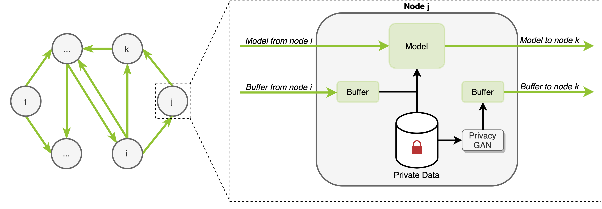

<div align="center">

# FedER: Federated Learning through Experience Replay and Privacy-Preserving Data Synthesis
Matteo Pennisi, Federica Proietto Salanitri, Giovanni Bellitto, Bruno Casella, Marco Aldinucci, Simone Palazzo, Concetto Spampinato

[](https://arxiv.org/abs/2206.10048)

</div>

# Overview
Official PyTorch implementation of paper: <b>"FedER: Federated Learning through Experience Replay and Privacy-Preserving Data Synthesis"</b>

# Abstract
 In the medical field, multi-center collaborations are often sought to yield more generalizable findings by leveraging the heterogeneity of patient and clinical data. However, recent privacy regulations hinder the possibility to share data, and consequently, to come up with machine learning-based solutions that support diagnosis and prognosis. Federated learning (FL) aims at sidestepping this limitation by bringing AI-based solutions to data owners and only sharing local AI models, or parts thereof, that need then to be aggregated. However, most of the existing federated learning solutions are still at their infancy and show several shortcomings, from the lack of a reliable and effective aggregation scheme able to retain the knowledge learned locally to weak privacy preservation as real data may be reconstructed from model updates. Furthermore, the majority of these approaches, especially those dealing with medical data, relies on a centralized distributed learning strategy that poses robustness, scalability and trust issues. In this paper we present a federated and decentralized learning strategy, FedER, that, exploiting experience replay and generative adversarial concepts, effectively integrates features from local nodes, providing models able to generalize across multiple datasets while maintaining privacy. FedER is tested on two tasks — tuberculosis and melanoma classification — using multiple datasets in order to simulate realistic non-i.i.d. medical data scenarios. Results show that our approach achieves performance comparable to both standard (non-federated) learning and significantly outperforms state-of-the-art federated methods in their centralized (thus, more favourable) formulation.
 
 # Method
 <p align = "center"></p>
 
 # How to run
 The code expects a json file containing the image paths and their respective labels, formatted as follow:
 ```python
{
 "train": { "pos": [ {"image": #path,  
                      "label": #class}, 
                       ...
                       {"image": #path,  
                      "label": #class},
                      ],
            "neg": [ {"image": #path,  
                      "label": #class},
                      ...],
 "test": [ {"image": #path,  
            "label": #class}, 
             ...
             {"image": #path,  
            "label": #class},
            ],
}
```
 
 ## Pre-requisites:
- NVIDIA GPU (Tested on Nvidia GeForce RTX 3090)
- [Requirements](env.yaml)

## Train Example
```bash
python federated_simulation.py --n_nodes 2 --dataset Tuberculosis --n_rounds 100 --num_epochs 100 --buffer_size 512 --learning_rate 1e-4 --setting non-IID

```

## Notes
The GAN weights can be downloaded from [here](https://studentiunict-my.sharepoint.com/:u:/g/personal/uni307680_studium_unict_it/ESlmUPw5tn1DsVCHGUxoNk8B21XhxxyW574W45PbYEAW4g?download=1)

